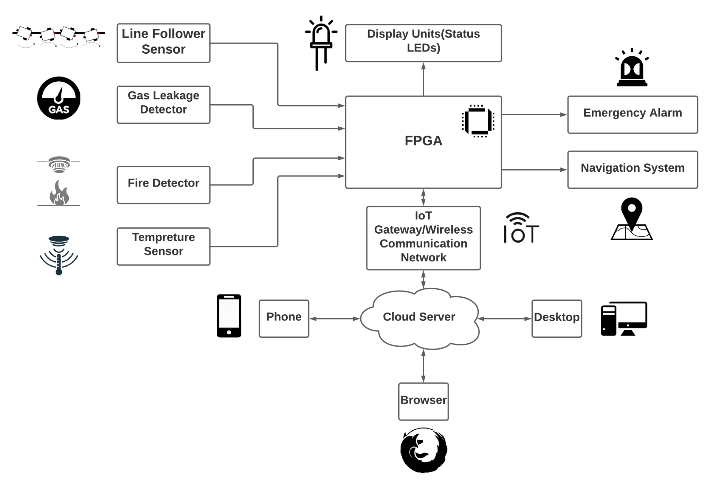

# Description

# Block Diagram

# Novelty
We will be building a robot from scratch by using a FPGA so there's more scope of research and
improvement. The FPGA based robot will traverse through the different parts of industry, sensing
the environment. It will also use wired and wireless broadcast communication techniques. This
will help to build a sophisticated Architecture using Verilog HDL and unveil the powerful parallel
processing capabilities of FPGAs. Thus the Compact and Portable design of bot can bring
features like Rapid deployment, Completely mobile: No AC required.

# Applicable Fields
1. Chemical Industries(other industries also)
2. Warehouse
3. Cold Storages
4. Medical Research Area
5. Museums and many more places for surveillance.

# Future Path
1. Camera and SD Card can be mounted on FPGA for better surveillance and error detection.
2. It is even possible to build a dedicated ASIC specially for surveillance purposes as a future work.
3. Multipurpose implementation for the same bot can be possible because FPGA can easily be reprogrammed, or work in different modes.
