# Getting Started With Quartus 

Here we will start with the Quartus software. We will create projects( Which will contains nedessary files), HDL files( It will contain desired hardware implimentation design), waveform vector files( It will contain waveform responce of the HDL description) and test benches( For validating the HDL description). 

## **1. Creating a new project**

- In order to create the project select any of the option which is highlited below

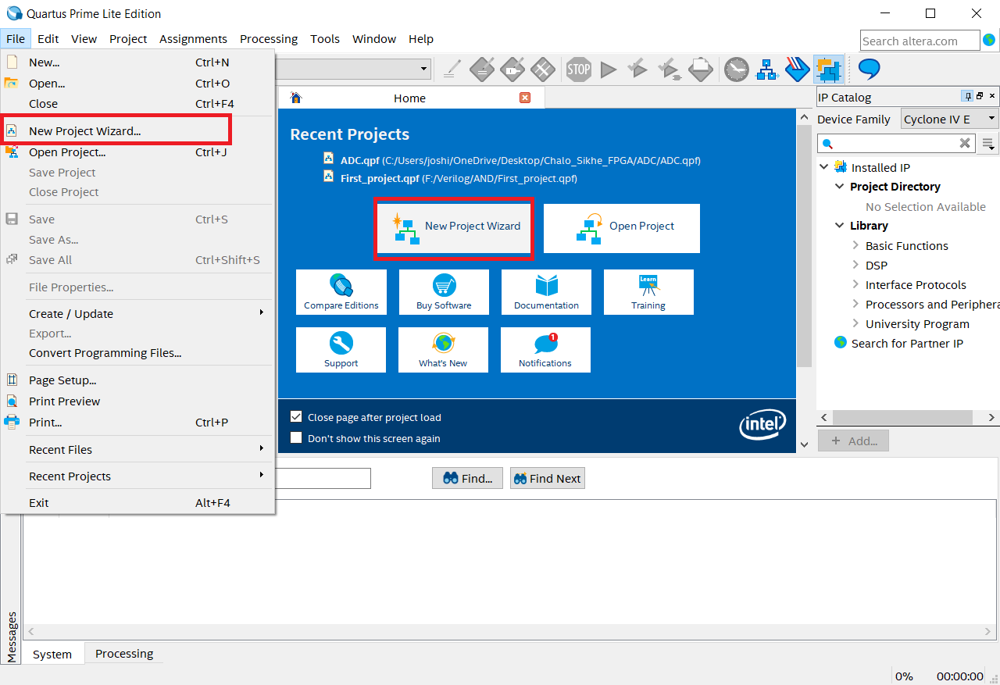

- Now click on the ```next``` for further process

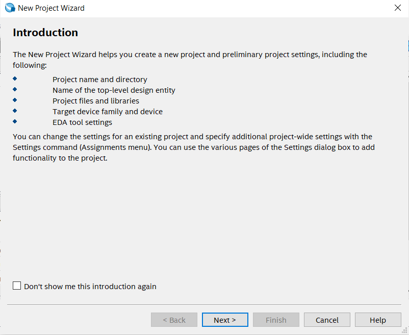

- In below step please select the target folder and give the name of the project and click on the next

>Note: If possible then please not select target folder in ```C partition```

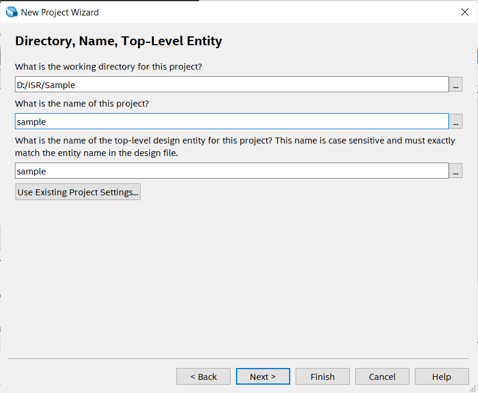

- Click on ```empty project``` for manually selecting or adding additional files, libraries, devices, EDA( Electronic Design Automation) tool selection and HDL selection.

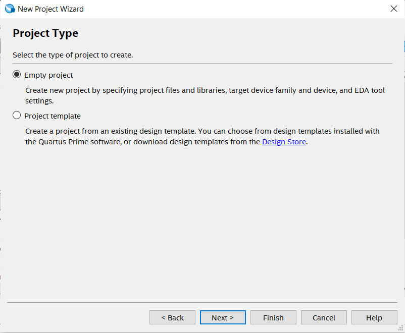

- In add file section directly click on the next, since for now we don't require any files.

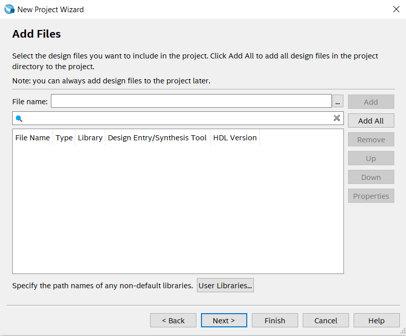

- In this step carefully select the familt which is ```Cyclone IV E``` and from avalable device select ```EP4CE22F17C6``` . Here insted of scorlling we can search the device by simply giving name in right side.

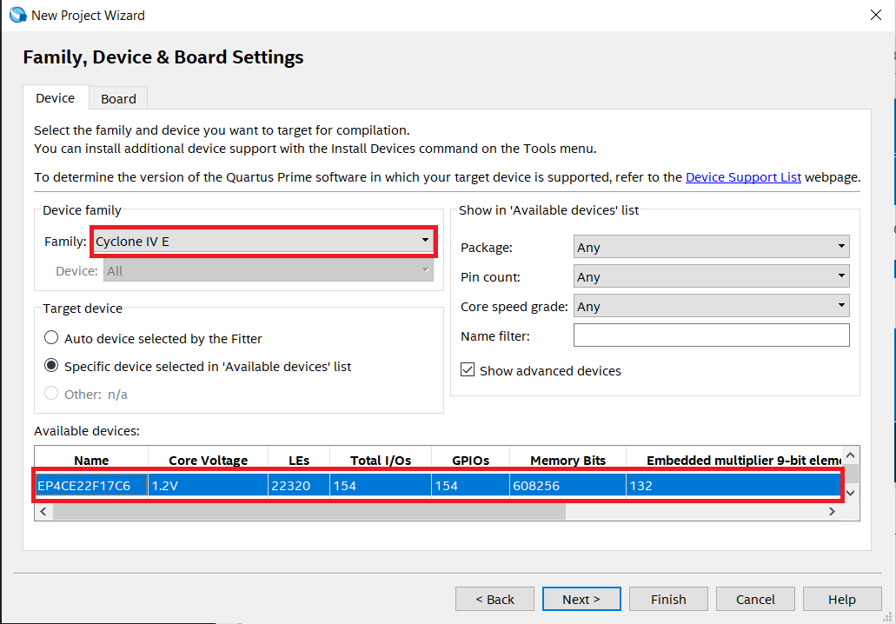

- Select simulation tool as ```ModelSim``` and select simulation format as ```Verilog HDL```.

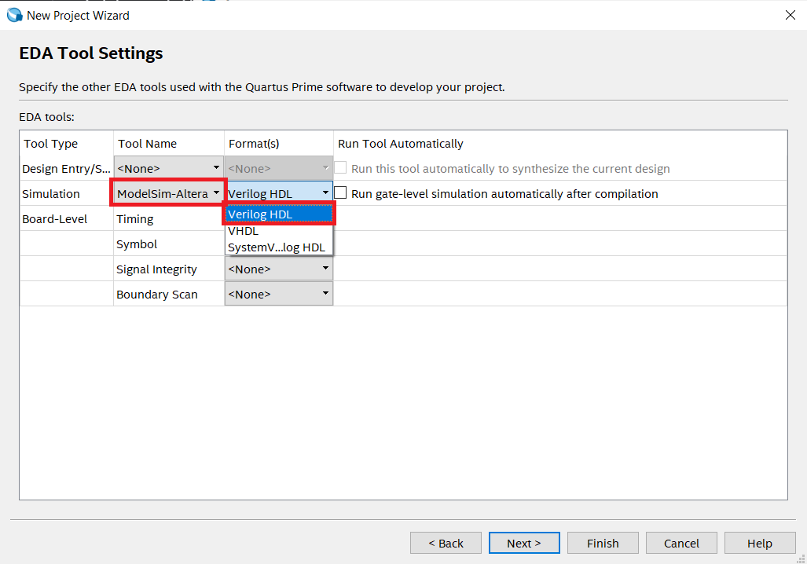

- There is summery of the selected options and configuration. Once these things are saved then they will not be changed through out the project.
- Click on the ```Finish``` for successfully creating a new project.

## **2. Creating a new file in a project**

- After creating a project and setting up the Quartus for a perticular boards and configuration by the project creation, We can now add the HDL description in the project by creating a new files( Here ```verilog files```).
- We will firstly start with the creating the ```AND gate```. As we know it will have 2 input and 1 output. 
  - Here ```A``` and ```B``` will be as input pins and ```C``` will be as output pin.

Follow the steps for creating a new file:

- Click on **File --> New**

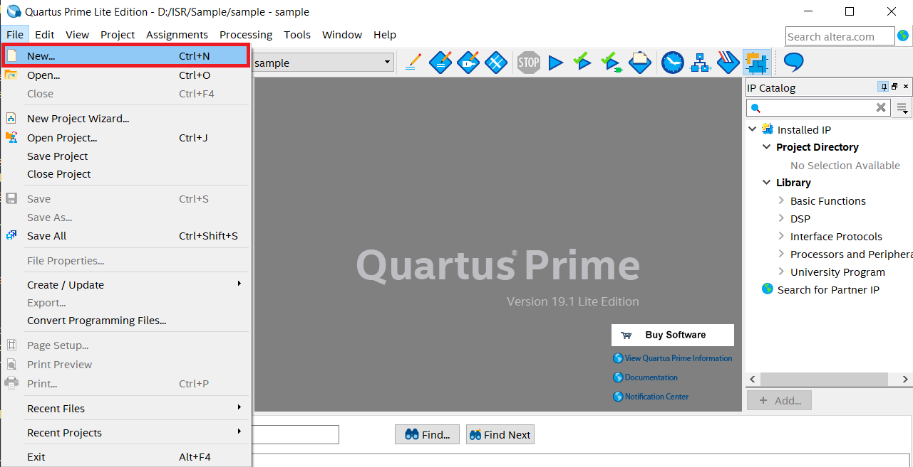

- Select ```Verilog HDL File``` and then click on ```OK```.
> Here we can also select VHDL as HDL source but for now we are going ahead with Verilog HDl but remember VHDL is also a powerful HDL.

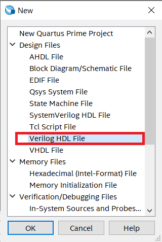

- For testing please paste the below code in newly created file. 

- Verilog code for AND gate

```
module AND_GATE        // Module name: AND_GATE
(
	input A,B,        // defining inputs A and B of AND gate 
	output C          // defining output of AND gate
);

assign C = A & B;   // Logic implementation
endmodule

```

- After writing this code press ```ctrl + s``` for saving the file and give the name same as you given the name of module which is ```AND_GATE``` here. 
- It's applied for the top level entity so we need to follow this method of naming for top level file which will contain main design which can be individual file or combination of different HDL design files.


## **3. Compiling or synthesizing the project files**

- For compiling the file or design firstly selet it as top level entity.
- After selecting it as top level entity there wil be message highlited as below.

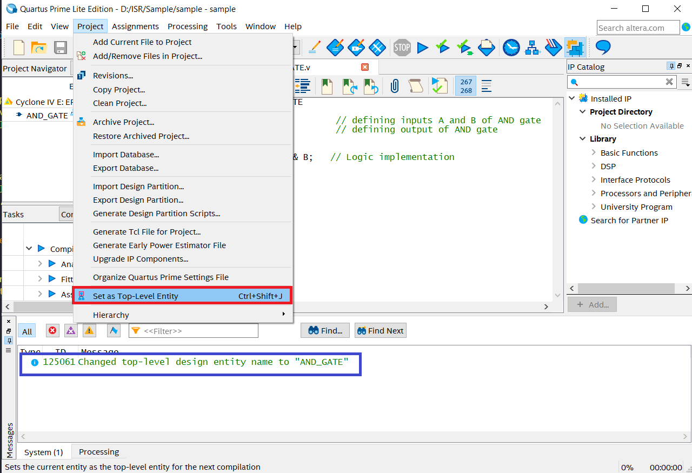

- Click on Start compilation icon or press ```ctrl + L``` for compilation of ```AND_GATE```

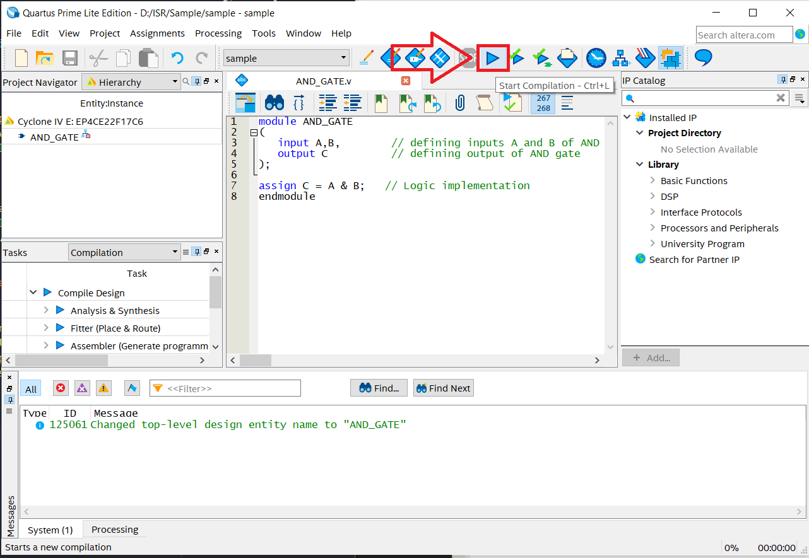

- During the compilation these processes are carried out.

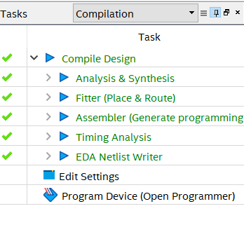

- After compilation if there will not be any error then we can see this kind of message at the end.
- If there is any error then we need to correct the code.

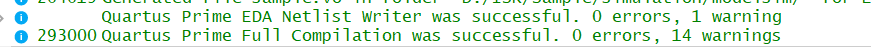

## **4. Verifying HDL Description**

We can perform timing simulation of a perticular module using EDA simulation tools. There are two methods for verifying the designs. 

1. By appplying manual inputs to the input pins.
2. By designing testbench for the module, we can verify the design.

### **First method**

- click on ``` File --> New --> University Program VWF```.

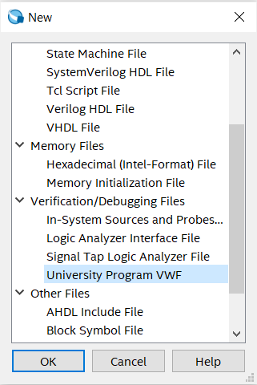

- Click on the ```Edit --> Insert --> Insert Node or Bus```.

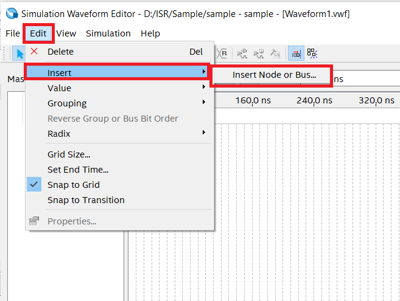

- Click on the ```Node Finder``` for finding the avalable nodes.

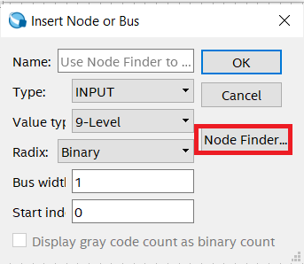

- Now click on the ```List``` for listing own the avalable Nodes.
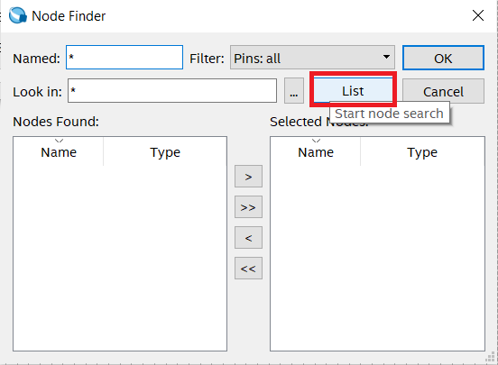

- Click on the ``>>`` for selecting the avalable nodes. Here we can also select a perticular node by clicking ```>``` . and from othere option we can put the selected nodes in to avalable node section.
- After this process click on ```OK```.

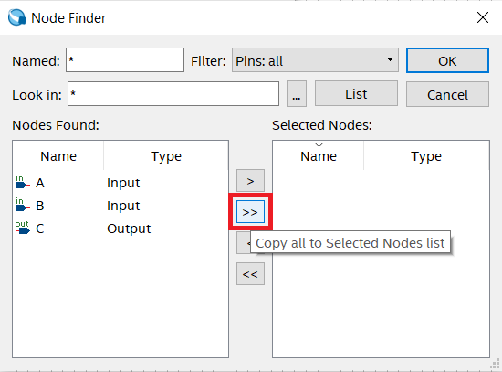

- Now the waveform editior will pop up and we can select the different logic levels and clocks. 
- In below we have selected clock with different periods for analizing the possible output.

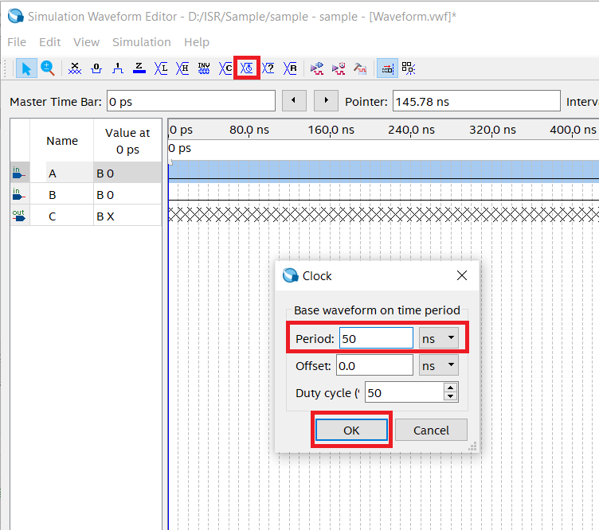

- Now click on the ```simulation --> Run Functional SImulation``` .

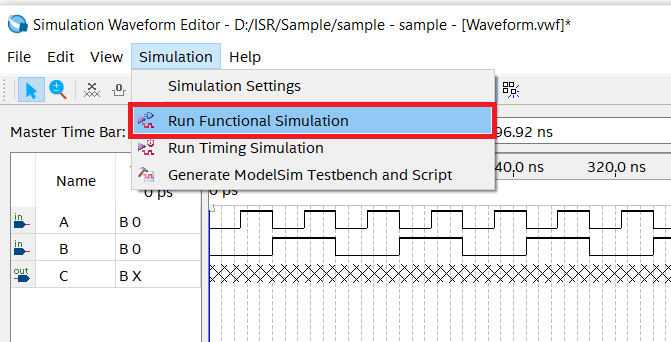

- After that a ```simulation flow window``` will pop up and after that the output window will be shown.

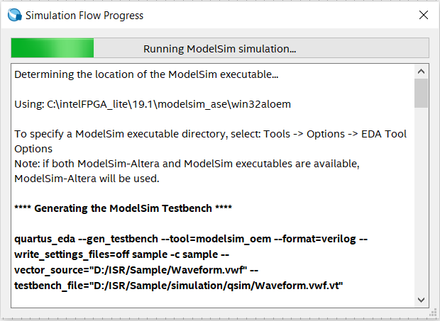
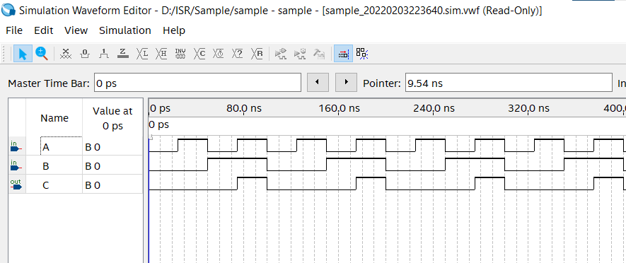