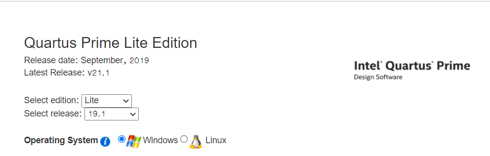
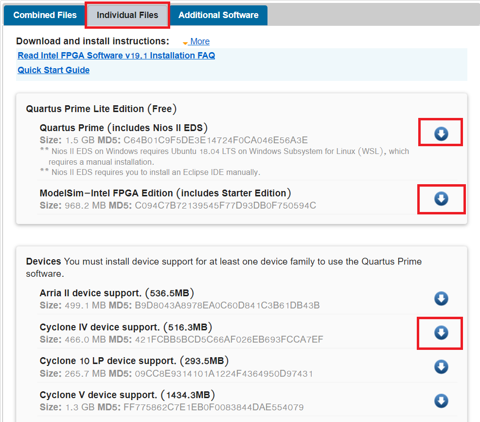
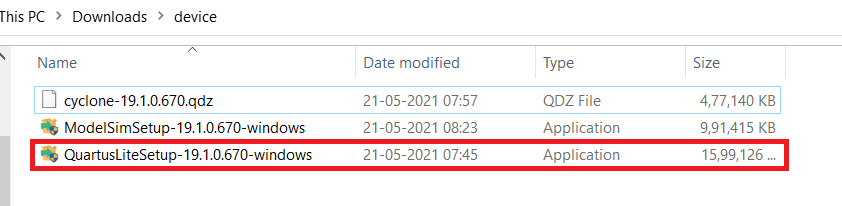
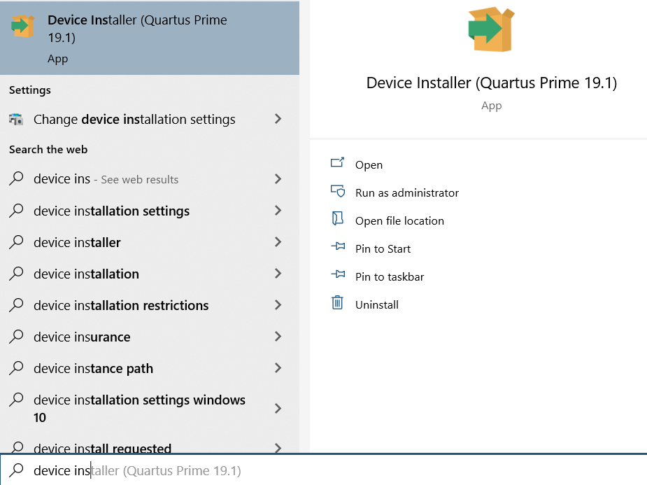
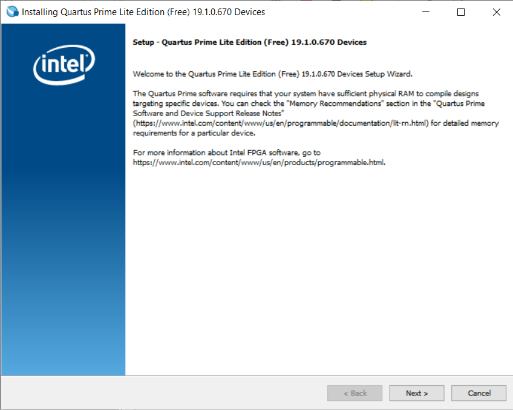
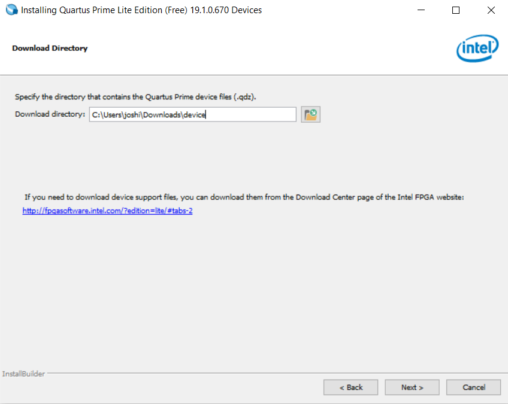
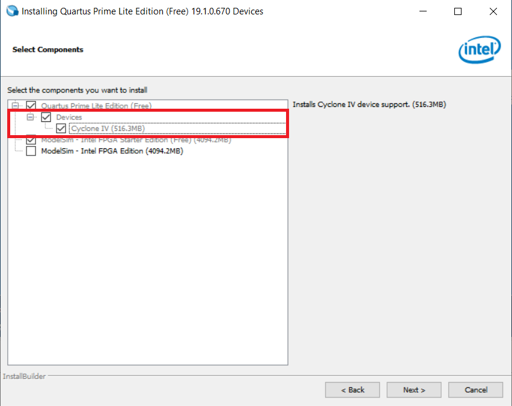

# Installation of Quartus Prime 19.1 Lite & ModelSim

Please follow below link for the installation of the softwares.

[Installation Link](https://fpgasoftware.intel.com/19.1/?edition=lite&platform=windows)

Please select the options which are displayed below



There are two ways for installing the software:

1. Installing by downloading ```Combined Files```
2. Installing by downloading ```Individual Files```

We will Download from Individual files since we are working with a perticular board so it will save some data :)

Please select the options which are displayed below and download 3 files for getting started with installation.



After downloading the files this 3 files will be there in download folder or it will be on the perticular path which you have selected.



## **Installation steps**

1. Double click on highlited application and install it with the default options.

    - At the end it will take some time for getting Quartus and ModelSim installed.

2. After the installation we need to add the device which is ```Cyclone 4```, It's for getting the support of ```de0 - neno board```.

    - copy the ```cyclone-19.1.0.670.qdz``` file( which is for ```Cyclone IV``` support file) in the ```C:/intelFPGA lite/19.1/modelsim ase/win32aloem``` for getting the support of that device family while working with the project. 
    - QDZ file is a Altera Quartus II Device Package. Altera Quartus is a programmable logic device design software from Altera which is now owned by INTEL.

- There is another way of adding the device!
    - click on start menu and search for ```Device installer```



- Open this application and do as directed



- Click on the next



- Select the folder in which you are having ```.qdz``` file/files and then click on the next.



- Select the required device and click on the next and get it done!

**Now the installation is done ;)**


